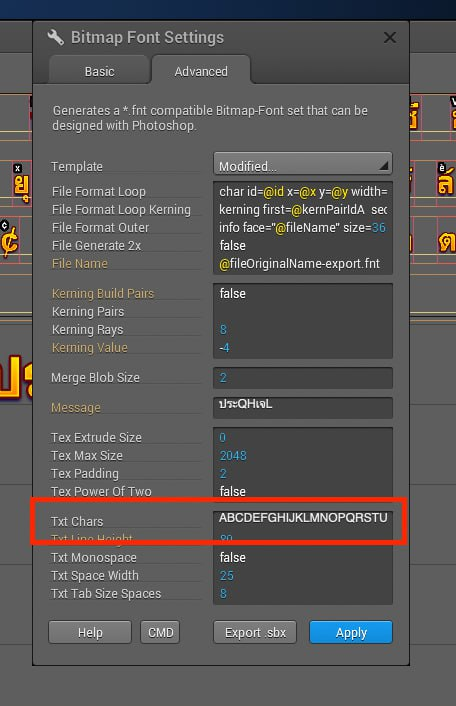

# thai-bmfont-kit
Generate string to create bitmap font for Thai Language

## Issue
- Chữ Thái là chữ tượng hình, có 4 dấu thanh và ghép vần tương tự Tiếng Việt
(khác nhau: vd chữ "ứ" ở tiếng Việt sẽ được xem như 1 kí tự và tạo bitmap font dễ dàng,
trong khi đó chữ "ตั้" sẽ thành 3 kí tự "ต- ั- ้" -> bitmap font không tự ghép lại được
- Hiện tại khi split ký tự bằng javascript thì dấu sẽ bị tách ra thành ký tự riêng,
dẫn tới khó khăn khi tạo bitmap font.

- Tool này dùng để map lại ký tự và làm bitmap font cho tiếng Thái, tương tự như xuất font tiếng việt có chữ "ứ ứ ừ ử" 

## Setup and run
1. Install python-shell

        npm i

2. Install regex module for python
        
        pip3 install regex

3. Paste your Thai messages to file: localizeText.json
```json
// example
{
  "NETWORK_MESSAGE": {
        "NETWORK_POOR": "เซิร์ฟเวอร์ถูกตัดการเชื่อมต่อ กำลังเชื่อมต่อใหม่...",
        "NETWORK_DIE": "ขออภัย เซิร์ฟเวอร์ถูกตัดการเชื่อมต่อ",
        "AUTHEN_FAIL": "การยืนยันบัญชีล้มเหลว",
        "LOGIN_IN_OTHER_DEVICE": "บัญชีได้เข้าสู่ระบบบนอุปกรณ์อื่น",
        "EXIT": "ออก"
    }
}
```
4. Run 

        npm start

## Result

String for photoshop: text đã add sẵn space, gửi cho art để làm hình  

```
String for photoshop: ชื่  ทั้  นี้  ริ่  สิ้  สู่  อื่  กั  กำ  กิ  ข้  ชี  ซิ  ฏิ  ณ์  ด้  ตั  ต่  ถู  บั  ภั  ม่  ยั  ยื  ยุ  รั  ร็  ร์  ลั  ลิ  ลื  ล้  สุ  อุ  .  ก  ข  ง  จ  ญ  ด  ธ  น  บ  ป  ฟ  ม  ย  ร  ล  ว  ส  ห  อ  ะ  า  เ  แ  ใ  ไ  ๆ  
```

bmFont string: định nghĩa các ký tự đã được map tương ứng với hình trong font.
( giống như gõ 'as' để được chữ 'á' trong tiếng việt ) 
( "Q" => "ซิ" )
```
bmFont string: ABCDEFGHIJKLMNOPQRSTUVWXYZabcdefgh.กขงจญดธนบปฟมยรลวสหอะาเแใไๆ
```


output.json: các text message đã được generate lại theo mapping bitmap font mới.
``` js
    // localizeText
    "btnStart": "เริ่ม", // system font
    // output.json
    "btnStart": "เDม", // bitmap font
```

## Credit
        Ai xài thì đi team building mời a Duy 1 ly.
